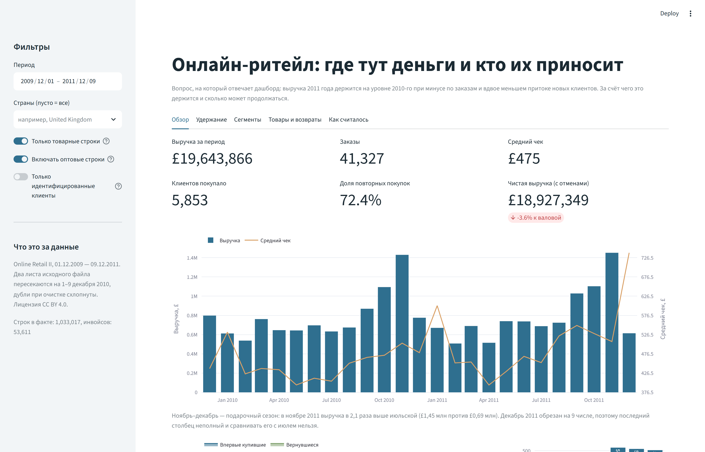
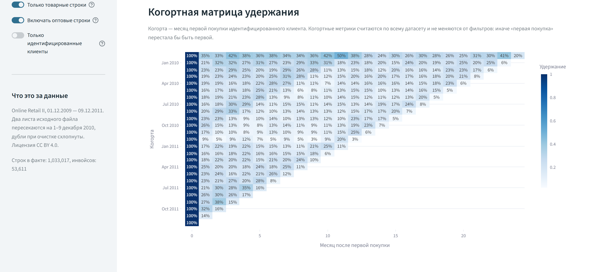
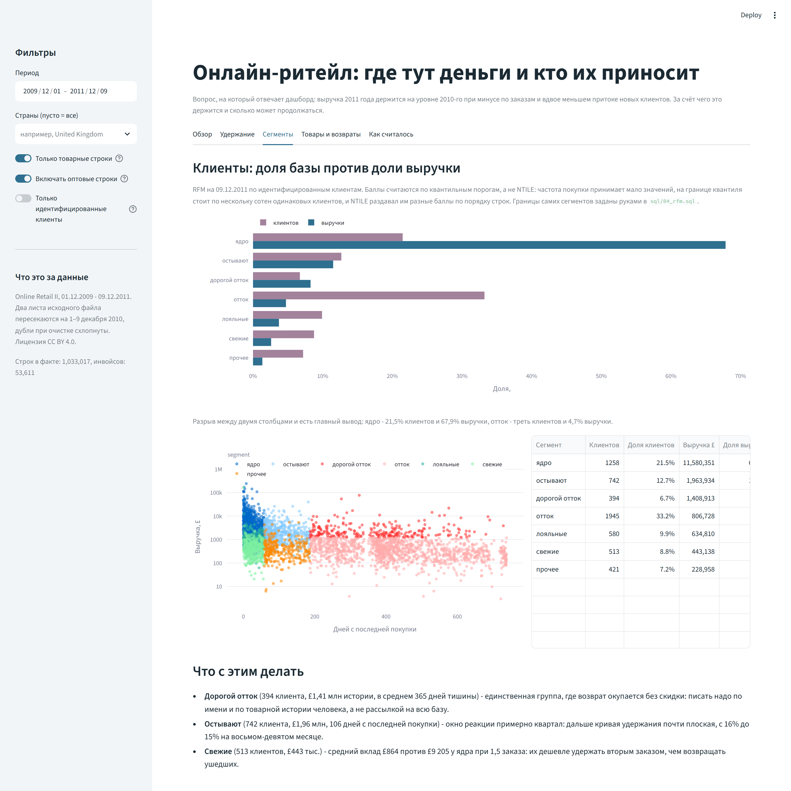
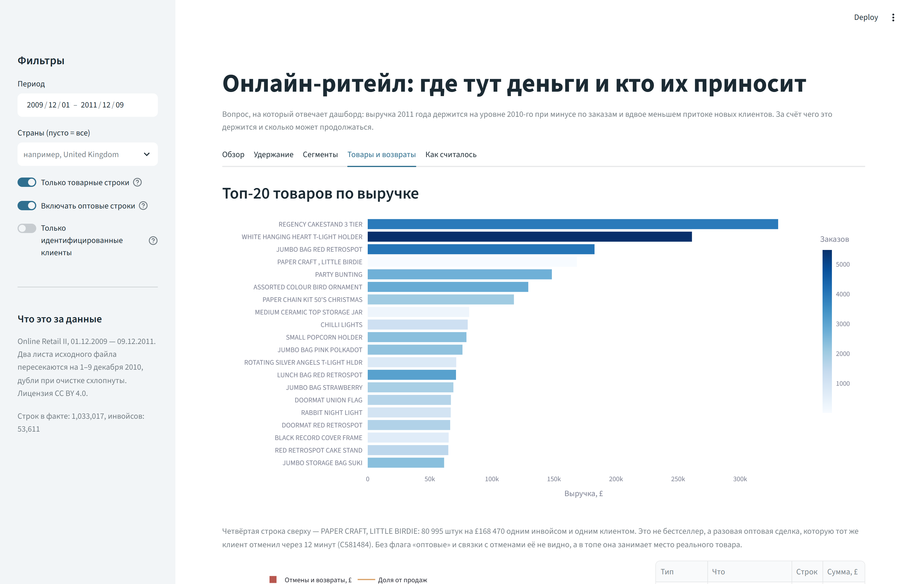

# Удержание клиентов: разбор Online Retail II


В выгрузке оптового интернет-магазина, торгующего мелочью для дома, два года работы: с 01.12.2009 по
09.12.2011 и 1 033 017 строк после очистки. Выручка 2011 года почти совпала с 2010-м (£9,47 млн
против £9,38 млн), но собрана другим способом: заказов на 8,5% меньше, впервые купивших - в 2,2
раза меньше, а вернувшихся на 17% больше. Проект отвечает на вопрос, за счёт чего это держится и
сколько может продолжаться.

Внутри - очистка бумажной ERP-выгрузки, 16 SQL-витрин на DuckDB, дашборд на Streamlit, два
ноутбука и тесты, которые сверяют SQL с pandas.

> **In short.** A retention analysis of the UCI *Online Retail II* dataset (1.03M rows,
> Dec 2009 - Dec 2011): cleaning log, 16 DuckDB marts, a Streamlit + Plotly dashboard, two
> notebooks. SQL and pandas compute the same numbers two different ways, and a test suite fails
> if they ever diverge. CI runs the suite on a clean machine. Revenue in 2011 is flat
> year-over-year while new customers fell by 54% - the dashboard shows what holds the business
> up and for how long.

## Что видно из данных

| 2010 → 2011 | 2010 | 2011 | Δ |
|---|---:|---:|---:|
| Выручка, £ | 9 375 309 | 9 470 438 | +1,0% |
| Заказы | 20 629 | 18 877 | −8,5% |
| Впервые купившие | 3 364 | 1 538 | −54,3% |
| Вернувшиеся | 9 049 | 10 602 | +17,2% |
| Средний чек, £ | 454 | 502 | +10,4% |

Оба года обрезаны по 9 декабря, чтобы сравнивать их было более корректно.

- **Приток новых клиентов за год упал со средних 280 человек в месяц до 128.** Выручку держат
  вернувшиеся покупатели, а не новые.
- **Удержание падает быстро и рано останавливается:** со 100% в месяце первой покупки до 21% в
  следующем и до 15% на восьмом-девятом месяце жизни когорты. Дальше кривая почти плоская - то
  есть окно реакции на «вторую покупку» измеряется первыми двумя-тремя месяцами.
- **Медианный интервал между покупками - 25 дней, P75 - 62.** 55% интервалов укладываются в
  месяц, дольше полугода живут только 6,4%. Рабочий цикл покупателя здесь около месяца.
- **Половину оборота дают 258 клиентов из 5 853 (4,4%), 80% - 1 353 (23%).**
- **Выручку 2011 года держит чек внутри Великобритании, а не экспорт.** Великобритания - 85,5%
  оборота, экспорт в Европе и на Ближнем Востоке - 13,0%, прочие страны - 1,4%. По британской
  выручке 2011-й −0,5% при заказах −10,6% (средний чек £421 → £469); экспорт принял +19% заказов
  при той же выручке (чек £894 → £756), то есть пришли мелкие покупатели. Рост «прочих стран» в
  2,7 раза - это три австралийских инвойса на £61,4 тыс., 31% группы.
- **RFM-сегменты:** ядро - 21,5% клиентов и 67,9% выручки (£9 205 среднего вклада, 17 заказов);
  отток - треть клиентов и 4,7% выручки (£415 на человека). Возвращать отток рассылкой
  нечем, работать надо с «остывают» (742 клиента, £1,96 млн, 106 дней тишины) и «дорогим
  оттоком» (394 клиента, £1,41 млн, 365 дней тишины).
- **Из £1,46 млн отмен £745,5 тыс. (51%) - не возвраты товара, а финансовые проводки:**
  комиссия маркетплейса, bad debt, manual-корректировки, банковские списания. Показывать их
  бизнесу одним числом с реальными возвратами нельзя.
- **Четвёртая строка в топе товаров - фикция.** PAPER CRAFT, LITTLE BIRDIE: 80 995 штук на
  £168 470 одним инвойсом от одного клиента, отменённые через 12 минут (C581484).

## Дашборд

Пять вкладок: обзор, удержание, сегменты, товары и возвраты, методика расчёта. Фильтры -
период, страны, товарные/оптовые строки и «только идентифицированные клиенты»; когортные и
RFM-метрики фильтрам не подчиняются, иначе «первая покупка» перестала бы быть первой.






## Как запустить

Нужен Python 3.10+ (проверялось на 3.12).

```bash
python -m venv .venv
source .venv/bin/activate          # Windows: .venv\Scripts\activate
pip install -e ".[dev]"

python -m retail_analytics.prepare # скачает архив UCI (45 МБ) и соберёт факт
python -m retail_analytics.marts   # прогонит sql/ через DuckDB, разложит витрины по parquet
streamlit run dashboard/app.py

pytest -q                          # 41 тест
pytest -q -m "not slow"            # 33 из них без пересборки витрин и дашборда
```

`data/curated/` с фактом и витринами лежит в репозитории, поэтому дашборд стартует и без первых
двух команд. `prepare` повторно не скачивает файл, если он уже в `data/raw/`; чтобы заставить -
`--force-download`. Пересборка витрин детерминирована: у каждой финальной таблицы в `sql/` есть
`ORDER BY` с уникальным ключом, а тест `test_marts_reproducible` сверяет байты заново собранных
parquet с теми, что лежат в git.

## Структура

```
dashboard/app.py        Streamlit: пять вкладок, фильтры, подписи с цифрами
src/retail_analytics/
  config.py             URL источника, коды нетоварных позиций, группы стран, ключ дедупликации
  prepare.py            выгрузка → fact_transactions.parquet + журнал чистки
  metrics.py            те же метрики на pandas: выручка, когорты, RFM-интервалы, концентрация
  marts.py              прогон sql/ в DuckDB и раскладка витрин по parquet
sql/01…08_*.sql         база и вьюхи, месячные KPI, когорты, RFM, страны, товары, отмены, нетоварные
notebooks/01_…          журнал чистки с проверками и находками
notebooks/02_…          удержание: когорты, интервалы, сегменты, концентрация
tests/                  метрики на фикстуре, сверка витрин с pandas, сборка app.py, пересборка parquet
.github/workflows/      ci: pytest на чистой ubuntu без data/raw
data/curated/           факт (7,7 МБ) и 16 витрин (0,3 МБ)
```

## Определения, которые важно не перепутать

- **Выручка** - только строки продаж и только товарные позиции. Доставка (DOTCOM POSTAGE,
  POSTAGE, CARRIAGE - £450,2 тыс. за два года) и служебные проводки (Manual: £339,2 тыс.
  против −£422,6 тыс. отмен, bad debt, комиссия Amazon) показаны отдельной витриной: вся
  нетоварная часть даёт −£72,6 тыс. к итогу.
- **Чистая выручка** - выручка плюс отмены и возвраты (они отрицательные): £18,93 млн против
  £19,64 млн валовой, −3,6%.
- **AOV** - сумма инвойса, усреднённая по инвойсам. Не «средняя строка»: при 25 позициях в
  инвойсе это другие числа.
- **Новый клиент** - месяц первой покупки по всей истории, а не по выбранному окну.
- **Когорта** - месяц первой покупки; активный месяц засчитывается один раз, сколько бы покупок
  в нём ни было.

## Что здесь не так и почему я это оставил

- **Возвраты не измеримы в деньгах.** У всех 3 393 строк возврата `unit_price = 0` - сумма
  возврата в системе не фиксируется, видно только штуки.
- **22,8% товарных строк продаж без `customer_id`** (13,1% выручки). Это не «гости» в
  веб-аналитическом смысле, а строки, где не заполнили клиента: в выручку они входят, в
  удержание - нет.
- **Декабрь 2011 обрезан на 9 числе**, поэтому последний месяц в каждом графике неполный, а
  «всплеск отмен» в декабре (33% против 7,9% в среднем) частично артефакт этой обрезки.
- **RFM-баллы считаются по квантильным порогам, а не по `NTILE`.** Частота покупки принимает мало
  значений, и на границе квантиля стоит по нескольку сотен одинаковых клиентов: `NTILE`
  раздавал им разные баллы по порядку строк, и на пересборке витрины 33 человека меняли
  сегмент. С порогами группы неровные, но один клиент не может попасть в два сегмента сразу.
- **Границы сегментов заданы руками** в `sql/04_rfm.sql`. Это компромисс: так сегменты
  объясняются словами, но другой аналитик расставил бы их иначе.
- **Нет себестоимости, рекламы и доставки по складу.** Маржинальность и CAC посчитать нельзя,
  поэтому выводы ограничены оборотом и поведением покупателей.
- **Данные публичные и описывают магазин 2009–2011 годов, а не вашу базу.** Это разбор формы
  данных: гипотезу про окно реактивации на своей истории надо перепроверять, а не брать готовой.

## Данные и лицензии

[Online Retail II](https://archive.ics.uci.edu/dataset/502/online+retail+ii), UCI Machine Learning
Repository, лицензия CC BY 4.0. По описанию UCI - лондонский интернет-магазин товаров для дома
и офиса, работает и с оптовиками, и с розничными покупателями. Листы «2009-2010» и «2010-2011»
перекрываются на 1–9 декабря 2010, а всего точных копий в файле 34 337 строк - часть из них дубли
внутри одного листа. Журнал всех изменений лежит в `data/curated/dq_changes.parquet` и показан на
вкладке «Как считалось».

Код проекта - MIT (см. `LICENSE`). Датасет остаётся под CC BY 4.0.
